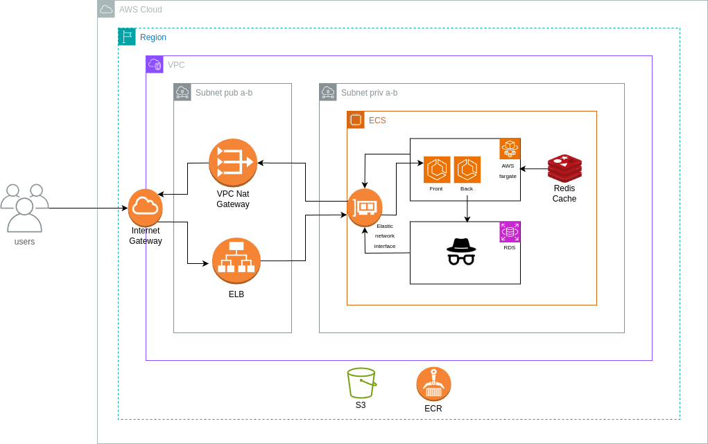

# Infraestructura Escalable para Aplicación de E-commerce en AWS

## Descripción

La empresa JFC está desarrollando una nueva aplicación de e-commerce de 3 capas (Frontend, Backend y Base de Datos) que permitirá a los usuarios comprar productos en línea. Este proyecto implementa una infraestructura escalable y altamente disponible en AWS para alojar la aplicación y manejar de manera eficiente el tráfico variable, desde unos pocos cientos de usuarios hasta varios miles de usuarios simultáneamente.

## Requisitos Previos

- [Terraform](https://www.terraform.io/downloads.html)
- [AWS CLI](https://aws.amazon.com/cli/) configurado con las credenciales necesarias
- Una cuenta de AWS con permisos adecuados

## Arquitectura

La infraestructura desplegada en AWS incluye los siguientes componentes:

- VPC con subredes públicas y privadas.
- Application Load Balancer (ALB) para distribuir el tráfico entre las instancias de ECS.
- ECS Cluster con tareas Fargate para desplegar los contenedores de la aplicación.
- RDS para la base de datos relacional.
- ElastiCache para el sistema de cacheo.
- CloudWatch para monitoreo y logging.
- Route 53 para la gestión de DNS.
- IAM Roles y Policies para permisos y seguridad.

## Calculadora de Costos

Para asegurarme de que la solución propuesta se ajusta a mi presupuesto, he realizado una estimación de costos. Adjunto encontrarás un archivo PDF con los detalles de esta estimación, que incluye:

- Lista de recursos utilizados en la solución.
- Opciones de precios de AWS consideradas.
- Costos estimados para cada recurso.
- Consideraciones adicionales para escenarios de uso.

## Uso

1. Importante!!, si se ejecuta local crear el env `S3="ruta_save/terraform.tfstate"` y iniciar terraform asi `terraform init -backend-config "key=$S3"`. la razon es que en el .drone(CI/CD) separe los state de prod y testing

2. Revisa y ajusta el archivo `testing.tfvars` 0 `production.tfvars` con tus valores específicos

3. realiza el plan y apply con el .tfvars correcto `terraform plan -var-file=porduction.tfvars` o `terraform apply -var-file=porduction.tfvars`

## Contacto

Fabian Andres Hincapie - fabian.andres.h.h@gmail.com
celular - 3015969817
